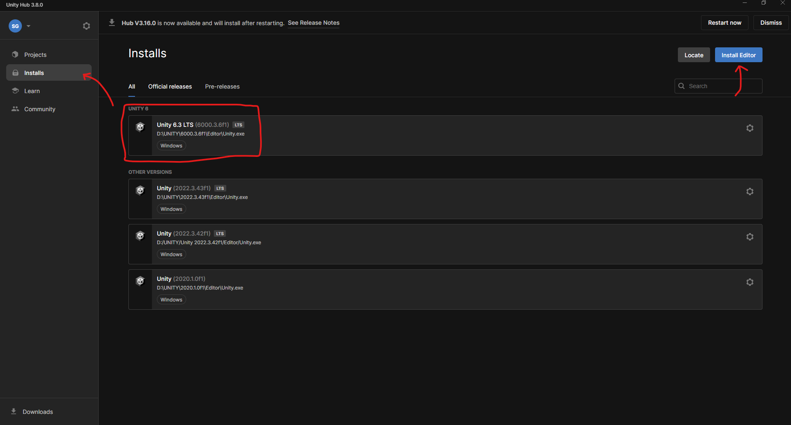

# Starting off, clone this repository in a drive that has a good amount of space:
```
Git clone https://github.com/Sterling-Gore/VR-AR.git
```


# Install the Unity Applications:

### Download Unity Hub and install it on your PC:
- https://unity.com/download

### Install Unity Version Unity 6.3 LTS (6000.3.6f1)
You can Either use this link, or you can download it inside the Unity Hub
- https://unity.com/releases/editor/whats-new/6000.3.0f1


# Set up your Unity Hub:

### On Unity Hub -> "Installs"; make sure your Unity Hub instance has version ***Unity 6.3 LTS (6000.3.6f1)*** installed



### On Unity Hub -> "Projects";
1.) Click the Drop down arrow next to **"Add"**<br>
2.) Click "Add project from disk"<br>
3.) naviage to your Clone Repository and select ***"VR_Project"***<br>
** **The directory url should looks something like "{Your Directories}/VR-AR/VR_Project"** **


### Now you can open the project and work inside Unity.