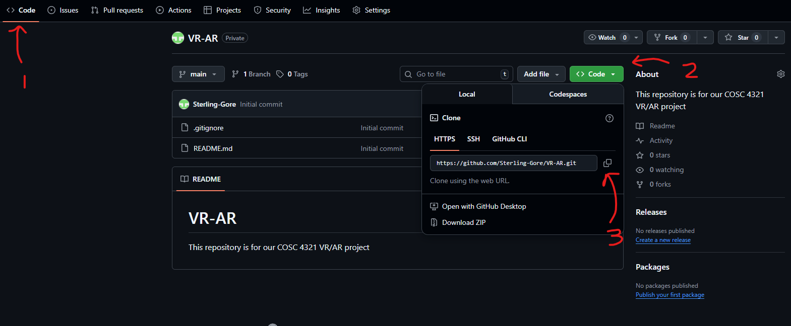
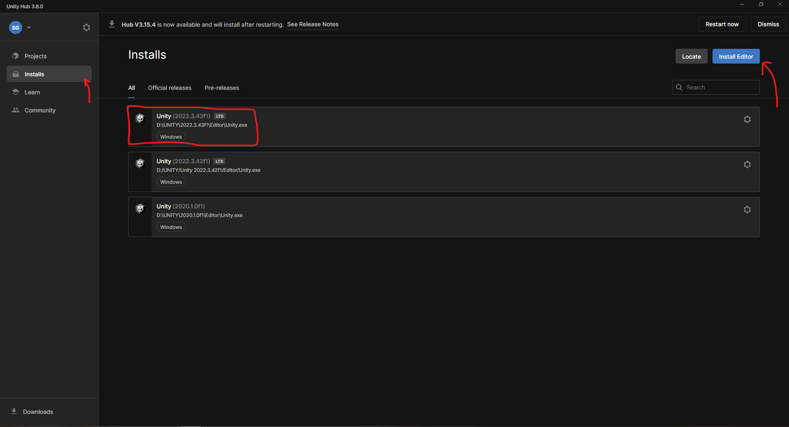
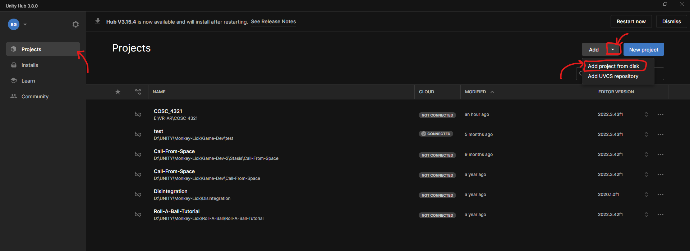

# Starting off, clone this repository in a drive that has a good amount of space:
```
Git clone https://github.com/Sterling-Gore/VR-AR.git
```


# Install the Unity Applications:

### Download Unity Hub and install it on your PC:
- https://unity.com/download

### Install Unity Version 2022.3.43f1
- https://unity.com/releases/editor/whats-new/2022.3.43f1


# Set up your Unity Hub:

### On Unity Hub -> "Installs"; make sure your Unity Hub instance has version ***2022.3.43f1 [lts]*** installed



### On Unity Hub -> "Projects";
1.) Click the Drop down arrow next to **"Add"**<br>
2.) Click "Add project from disk"<br>
3.) naviage to your Clone Repository and select ***"COSC_4321"***<br>
** **The directory url should looks something like "{Your Directories}/VR-AR/COSC_4321"** **


### Now you can open the project and work inside Unity.